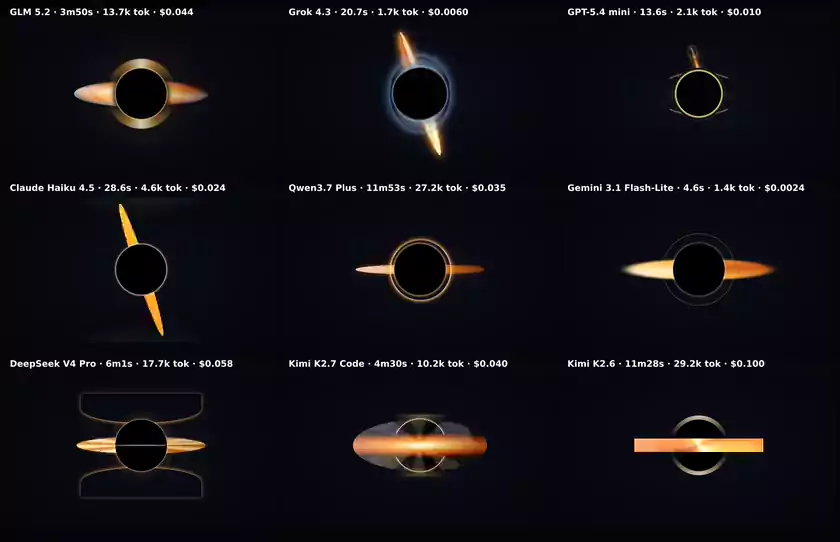

# Design Bench

A **visual benchmark for LLMs**. You give one creative brief; many models each generate a
single self-contained web page; we render every page in a headless browser, screenshot it,
and tile the screenshots into one **side-by-side grid PNG** so you can eyeball which model
did best.

It's built for *visual* tasks — not just landing pages but **three.js 3D scenes, canvas
particle systems, hand-coded SVG art, pure-CSS scenes**, anything that renders.

[](docs/preview.mp4)

> The animated benchmarks in motion (click for the [higher-quality mp4](docs/preview.mp4);
> regenerate with `node scripts/make-preview.mjs`). See **[`examples/`](examples/)** for
> all runs — a set of space scenes: an Interstellar-style black hole (still + spinning), a
> Saturn-like ringed gas giant, and a pure-CSS pulsar — including the actual HTML each model
> produced. There's also a **[showcase web app](web/)** (React/Vite, deployable to Vercel)
> that presents the runs with their prompts and per-model metadata.

---

## Goal

Design quality is visual and subjective — the fastest way to judge it is to **look at the
outputs next to each other**. Design Bench optimises for exactly that:

1. **One prompt, many models** — apples-to-apples by construction.
2. **Real renders, not code diffs** — we run the model's HTML in Chromium and screenshot
   what a user would actually see.
3. **One artifact to judge** — a single grid image (3 per row by default), each cell
   labelled with the model name, its time-to-completion, and output tokens.

The structure/execution mimics existing config-driven LLM benchmarks (a `models.json`-style
registry routed through OpenRouter's OpenAI-compatible API, à la
[`akitaonrails/llm-coding-benchmark`](https://github.com/akitaonrails/llm-coding-benchmark))
and visual front-end benchmarks (generate code → render in a browser → screenshot, à la
[`WebPAI/DesignBench`](https://github.com/webpai/designbench)).

---

## How it works

Five stages, run in order. Each writes artifacts to disk, so any later stage can be re-run
on its own.

```
config ──▶ ① generate ──▶ ② render ──▶ ③ grid ──▶ ③b video ──▶ ④ report
            (LLM API)      (Chromium)    (sharp)     (markdown)
```

1. **generate** — Send `systemPrompt` + `prompt` to every model (in parallel), extract the
   HTML document from each reply, save it.
2. **render** — Serve each page from a local HTTP server and screenshot it in headless
   Chromium at a fixed viewport.
3. **grid** — Scale every screenshot to a fixed cell width, label it (model name + time +
   tokens), and composite into one grid image, N columns wide.
4. **video** *(animated benchmarks only)* — encode the captured frames into per-model
   `clip.mp4` files and one composed `grid.mp4` (same layout as the image grid).
5. **report** — Write `report.md` (status table + embedded grid) and `summary.json`.

### The config is the run

Everything about a run lives in one JSON file (default
[`config/benchmark.config.json`](config/benchmark.config.json)) — the prompt, system
prompt, model list, render settings, and grid layout. To run a different benchmark, write
a different config. See [`config/examples/`](config/examples) for the three.js and pure-CSS
space-scene configs. A [JSON schema](config/schema.json) is wired in via `$schema` for
editor autocomplete.

```jsonc
{
  "name": "black-hole",
  "systemPrompt": "You are a creative three.js developer...",
  "prompt": "Render a realistic supermassive black hole — Interstellar's Gargantua...",
  "render": {
    "viewportWidth": 1280, "viewportHeight": 800,
    "fullPage": false,            // fixed dense top-crop, not the whole scrollable page
    "waitMs": 4000,
    "freezeClock": true, "seed": 7 // reproducible animated frame (see Determinism)
  },
  "grid": {
    "columns": 3, "cellWidth": 620,
    "labelStyle": "topbar"        // thin one-line strip on top (vs "overlay" pill / "banner" above)
  },
  "generation": { "temperature": 0.7, "maxTokens": 14000, "concurrency": 9 },
  "models": "../models/standard-9.json" // inline array, or a path to a shared lineup
}
```

Each grid cell's label shows **model name · time · output tokens**. Label styles: `topbar`
(thin one-line strip over the top of the render), `overlay` (corner pill), or `banner` (a
caption strip above each cell, used with full-page website screenshots).

`models` can be an inline array or a **path to a shared lineup file** so many configs use
the same models — the examples all use
[`config/models/standard-9.json`](config/models/standard-9.json): GLM 5.2, Grok 4.3,
GPT-5.4 mini, Claude Haiku 4.5, Qwen3.7 Plus, Gemini 3.1 Flash-Lite, DeepSeek V4 Pro,
Kimi K2.6, Mistral Small 4.

---

## Libraries & imports (no restrictions)

Renders are served over a **local HTTP server** (not `file://`), and an **importmap** is
injected into every page. So models can write modern code naturally:

```html
<script type="module">
  import * as THREE from 'three';
  import { EffectComposer } from 'three/addons/postprocessing/EffectComposer.js';
  import gsap from 'gsap';
  // ...
</script>
```

Those bare specifiers resolve to **pinned, locally-vendored** copies (served from
`node_modules`), so it's deterministic and offline — no fragile CDN URLs, no add-on 404s
leaving a black screen. Add a library by installing it (pinned) and adding its ESM entry
to [`config/importmap.json`](config/importmap.json). Models can also still use full CDN
URLs or no libraries at all. The artifact stays a **single HTML document** per model.

## Determinism

Animated renders are made reproducible (`render.freezeClock` + `render.seed`):

- **Seed** — `Math.random` is replaced with a seeded PRNG before any model code runs.
- **Freeze clock** — `requestAnimationFrame`, `performance.now`, and `Date.now` are driven
  by a virtual clock that advances by exactly `waitMs` worth of 60fps frames, then we
  capture. The render no longer depends on CPU speed or wall-clock timing.

Result: re-running a model's scene produces the **same frame** — verified pixel-identical
for both Canvas2D and WebGL. (Leave `freezeClock` off for CSS/SMIL-animated pages, which
run on compositor time rather than rAF; those settle with a real `waitMs` wait instead.)

## Animated benchmarks (video grids)

Some briefs are about *motion*, so the harness can capture a clip instead of a still.
Add `render.video` (requires `freezeClock`):

```jsonc
"render": {
  "freezeClock": true, "seed": 7,
  "video": { "durationMs": 5000, "fps": 24, "preRollMs": 2000 }
}
```

Frames are captured **offline**: the virtual clock is stepped exactly `1000/fps` ms at a
time and each frame is screenshotted, so the clip is smooth and deterministic no matter
how slowly the scene renders in headless software WebGL (a scene running at 2 fps in real
time still yields a perfect 24 fps clip). The frames are then encoded (bundled static
ffmpeg — no system install) into per-model `clip.mp4` files and one **`grid.mp4`**: every
frame of the grid video is composed with the exact same layout, labels and placeholders as
`grid.png`, which doubles as the poster/mid-frame still. Raw frames are deleted after
encoding. The animated benchmarks ship as examples —
[`black-hole-spin`](config/examples/black-hole-spin.config.json) (the spinning Gargantua),
[`ringed-giant`](config/examples/ringed-giant.config.json) (a rotating Saturn), and
[`pulsar-css`](config/examples/pulsar-css.config.json) (a pulsar in pure CSS). The three.js
clips drive motion from the rAF timestamp; the CSS one uses CSS animations pinned to the
same virtual clock — all demand visible structure so the motion actually reads on camera.
Rebuild the README preview from the grid videos with `node scripts/make-preview.mjs`.

## Resilience

A render benchmark's success rate shouldn't be dominated by black screens, truncated code,
and timeouts. We apply the high-leverage fixes from
[`docs/render-benchmark-design-guide.md`](docs/render-benchmark-design-guide.md):

- **"Did it render" is separate from quality.** Each model's `result.json` records a
  `render` verdict, and the report's headline is an honest **render rate** (`5/9`), not a
  quality score.
- **Blank/black detection.** A screenshot with near-zero pixel variance "rendered" but
  shows nothing; we flag it `blank` (sharp pixel-stats gate) instead of counting it as a
  success — this caught a model whose token-truncated page screenshotted as solid white.
- **Truncation is a first-class signal.** We read the provider's `finish_reason`; a `length`
  stop marks the result `truncated` (a cut-off `</svg>`/`</html>` is the #1 cause of broken
  renders). Per-model `maxTokens` is configurable to avoid it.
- **Paint before capture.** `networkidle` fires before client-side animation paints, so for
  non-frozen renders we wait a double `requestAnimationFrame` before screenshotting (the
  guide's #1 fix for false blanks); frozen renders step frames deterministically.
- **Failure signals captured.** `pageerror` / `crash` listeners record *why* a page blanked,
  surfaced in the report and web app.
- **Reasoning-effort cap.** Hybrid-reasoning models default to spending thousands of tokens
  "thinking" and regularly burn the *entire* `max_tokens` budget before emitting any code —
  returning an empty completion. `generation.reasoningEffort: "low"` (sent as OpenRouter's
  normalized `reasoning.effort`) caps that spend; it took one run from 5/9 to 9/9 rendered.
- **Transient provider errors are retried.** A `finish_reason: "error"` (upstream cut the
  stream mid-generation) throws instead of yielding a partial document, so the retry loop
  (`generation.retries`) gets a clean second attempt. Model-side failures still fail honestly.
- **Uniform reliability guidance in the prompts.** Every brief tells models to paint a
  background first (a partial failure shows a scene, not a blank), keep documents complete
  ("simplify rather than truncate"), and — for WebGL — avoid postprocessing passes that run
  at seconds-per-frame in headless software rendering. Same guidance for every model, so
  the comparison stays fair.
- **Container-safe Chromium** (`--disable-dev-shm-usage`) and an explicit screenshot timeout.

What we deliberately *don't* do (out of scope for a small, local, judgment-first bench):
heavy sandboxing (gVisor/Firecracker), VLM-judge/rubric scoring, self-repair loops, and
few-shot skeletons (which would change *what* the benchmark measures — we test models cold).

---

## Providers

Calls go through **OpenRouter** by default — one API/key for ~all models. Because the
industry standardised on the OpenAI `/chat/completions` format, the same client also talks
to any OpenAI-compatible endpoint, and a native Anthropic provider is included.

| `provider`   | Backend                                  | Env vars |
|--------------|------------------------------------------|----------|
| `openrouter` | OpenRouter (default, recommended)        | `OPENROUTER_API_KEY` |
| `openai`     | OpenAI **or** any OpenAI-compatible host | `OPENAI_API_KEY`, optional `OPENAI_BASE_URL` |
| `anthropic`  | Anthropic Messages API directly          | `ANTHROPIC_API_KEY` |

Model `id`s are provider-specific — on OpenRouter they look like `anthropic/claude-haiku-4.5`
or `google/gemini-2.5-flash` (browse at <https://openrouter.ai/models>).

---

## Setup

Requires Node 20+.

```bash
npm install                 # deps + vendored libs (three, gsap) + Chromium
cp .env.example .env        # then add your OPENROUTER_API_KEY
```

Headless Chromium needs some system libraries:

```bash
sudo npx playwright install-deps chromium
```

**No sudo?** Use the rootless helper, which installs the libs + fonts into a local
`.runtime/` folder and writes an env file to source:

```bash
bash scripts/setup-browser-deps.sh
source .runtime/env.sh
```

---

## Run

```bash
npm run bench                                                      # default config
npm run bench -- --config config/examples/threejs-orb.config.json # a different one
npm run bench -- --model claude-haiku-4.5 --model gemini-2.5-flash # only some models
npm run bench -- --stage grid                                      # re-run one stage
npm run bench -- --dry-run                                         # no API calls (smoke test)
```

CLI: `--config/-c`, `--stage/-s` (`all|generate|render|grid|report`), `--model/-m`,
`--dry-run`, `--help`.

---

## Showcase web app

[`web/`](web) is a small React + Vite + TypeScript site that presents the runs as a single
scrollable page — each benchmark shows its grid, and an expandable section reveals the full
prompt and a per-model table (status, time, output tokens, error reason, and a link to the
actual generated page). It's built to deploy to **Vercel** (config in `vercel.json`; set
the project root to the repo and it runs `cd web && npm install && npm run build`).

```bash
node scripts/build-web-data.mjs   # regenerate web data from the latest runs (do this after a run)
cd web && npm install && npm run dev
```

`scripts/build-web-data.mjs` reads the configs + committed example runs and writes
`web/src/data/benchmarks.json` plus the grid images and per-model HTML into `web/public/`,
so Vercel builds purely from committed files.

## Output layout

```
results/<run-name>/
├── grid.png                  ← the side-by-side comparison (the deliverable)
├── report.md                 ← status table + embedded grid
├── summary.json              ← machine-readable run summary
└── models/<slug>/
    ├── raw.txt               ← the model's full raw reply
    ├── output.html           ← HTML extracted from the reply (what gets rendered)
    ├── screenshot.png        ← Chromium screenshot
    └── result.json           ← status, timing, token usage
```

## Project structure

```
design-bench/
├── config/
│   ├── benchmark.config.json     # the default run
│   ├── schema.json               # JSON schema for configs
│   ├── importmap.json            # bare-specifier → vendored-lib map
│   ├── models/standard-9.json    # the shared 9-model lineup
│   └── examples/*.config.json    # black-hole (3D), pulsar-css (CSS)…
├── web/                          # showcase app (React/Vite/TS, deploy to Vercel)
├── scripts/
│   ├── setup-browser-deps.sh     # rootless Chromium deps installer
│   ├── build-web-data.mjs        # regenerate the web app's data from runs
│   └── make-preview.mjs          # rebuild docs/preview.{mp4,gif} from grid videos
├── src/
│   ├── run.ts                    # CLI / orchestrator
│   ├── config.ts                 # load, validate, defaults, shared-lineup resolution
│   ├── generate.ts               # ① query models, extract + save HTML
│   ├── render.ts                 # ② screenshots (HTTP server + seed + virtual clock)
│   ├── server.ts                 # local static server + importmap injection
│   ├── grid.ts                   # ③ composite the grid + labels (sharp)
│   ├── report.ts                 # ④ report.md + summary.json
│   ├── html.ts · paths.ts · types.ts
│   └── providers/                # openrouter/openai-compatible + anthropic
└── examples/                     # committed real runs (grids you can look at)
```

---

## Design choices

- **TypeScript + `tsx`** — run the source directly, no build step, strict mode.
- **Plain `fetch`, no SDK** — one OpenAI-compatible client covers OpenRouter/OpenAI/etc.;
  Anthropic gets a ~30-line adapter.
- **Single-file artifact** — one HTML document per model is the most comparable, showable,
  diffable output. The HTTP-server + importmap gives flexibility without multi-file sprawl.
- **HTTP server + injected importmap** — lets models use ES modules, importmaps, and
  three.js add-ons normally, while keeping libraries pinned + vendored for determinism.
- **Fixed dense top-crop** (`fullPage: false`) — every cell is the same aspect, so the grid
  stays tidy and "presentation-ready" no matter how each model laid out its page.
- **Compact labels** — model name + time + tokens in a thin one-line strip over the render
  (`labelStyle: "topbar"`), for a clean gallery look that wastes no space; `"overlay"`
  (corner pill) and `"banner"` (strip above) are also available.
- **Determinism by construction** — seeded RNG + virtual clock make animated renders
  reproducible.
- **Stages are resumable**; **`--dry-run`** exercises render→grid→report with zero API spend.

## Scoring

Judgment-first by design: the output is a grid you look at. It records time and tokens but
assigns no automated design score — visual quality is the thing being measured, and a human
(or a vision-model judge you add downstream) is the rubric. The grid is built to make that
judgment fast.

## License

MIT.
