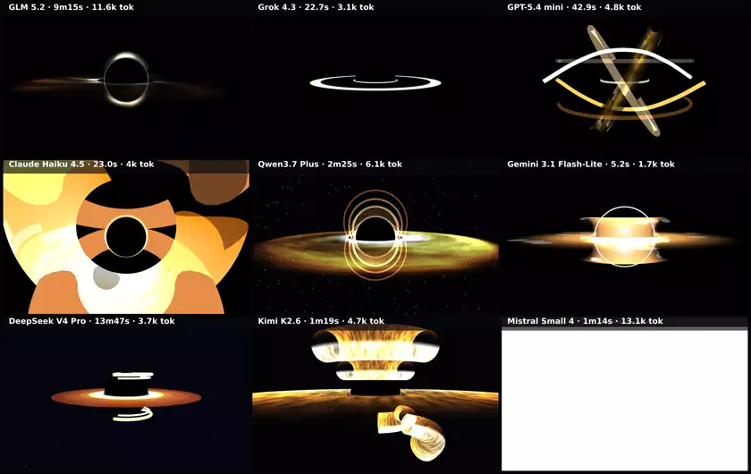
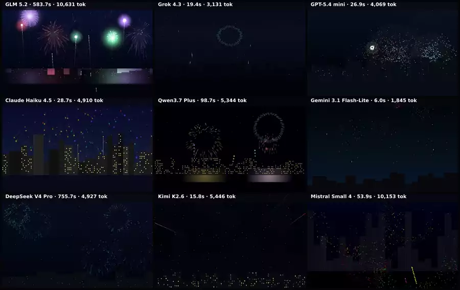
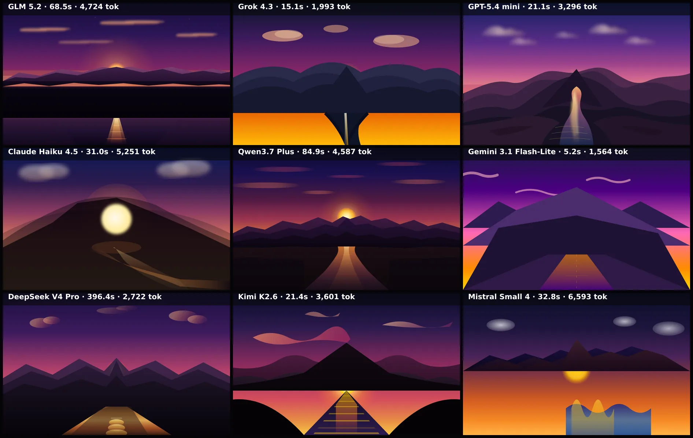
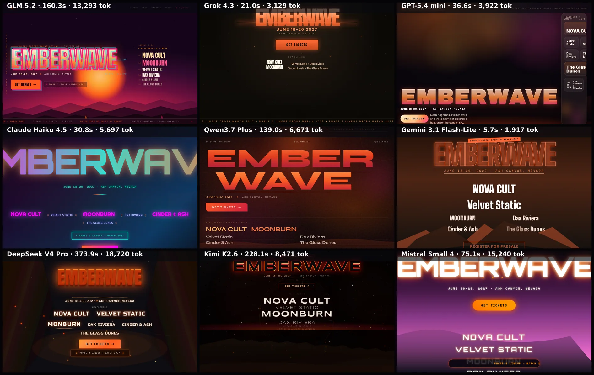

# Examples

Real runs of Design Bench. There's also a **showcase web app** that presents these with
the prompts and per-model metadata — see [`web/`](../web).

Every example uses the **same 9 models** (see
[`config/models/standard-9.json`](../config/models/standard-9.json)):

> GLM 5.2 · Grok 4.3 · GPT-5.4 mini · Claude Haiku 4.5 · Qwen3.7 Plus · Gemini 3.1 Flash-Lite · DeepSeek V4 Pro · Kimi K2.7 Code · Kimi K2.6

(black-hole's **Run #3** predates this lineup and used Mistral Small 4 in place of Kimi K2.7 Code —
kept as-is since it's an archived run, not reshot with the current lineup.)

Each folder has the grid (lossless `grid.png` + a ~10× smaller `grid.webp`), a `report.md`, a `summary.json`
(per-model time + tokens + status), and `pages/` (the actual HTML each model produced —
open them in a browser). Each grid cell carries a thin top-bar label: model name · time ·
output tokens. Reproduce any with:

```bash
npm run bench                                                  # festival-landing (default)
npm run bench -- --config config/examples/black-hole.config.json
npm run bench -- --config config/examples/black-hole-spin.config.json   # animated
npm run bench -- --config config/examples/fireworks.config.json         # animated
npm run bench -- --config config/examples/sunset-svg.config.json
```

The 3D and SVG prompts are **detailed and prescriptive** so the comparison is about
execution; the website prompt fixes the *content* but deliberately leaves the *art
direction* open, so design sensibilities diverge as far as possible.

---

## black-hole-spin — the animated one 🎬

The Gargantua composition judged in motion: a **5-second clip** (24 fps) is
captured per model on the deterministic virtual clock — frame-stepped, so even scenes that
crawl in software WebGL yield a smooth clip — and composed into one **[grid video](black-hole-spin/grid.mp4)**
with the same layout as the image grids. The animation below IS the grid video (embedded as animated WebP — click through for the full-quality mp4); the
prompt demands framerate-independent rotation (~25–40°/s) with visible disk structure so
the motion actually reads. Per-model clips are in [`black-hole-spin/clips/`](black-hole-spin/clips).
Config: [`config/examples/black-hole-spin.config.json`](../config/examples/black-hole-spin.config.json).

[](black-hole-spin/grid.mp4)

**Run #2** — a second set of generations for the animated brief ([grid video](black-hole-spin/run-2/grid.mp4)).
Switch between runs in the [web app](../web).

[](black-hole-spin/run-2/grid.mp4)

**Run #3** — the original animated run from before the lineup swap (Mistral Small 4
instead of Kimi K2.7 Code), recovered from git history and re-rendered through the current
pipeline ([grid video](black-hole-spin/run-3/grid.mp4)). Switch between runs in the
[web app](../web).

[](black-hole-spin/run-3/grid.mp4)

## black-hole — Interstellar "Gargantua" in three.js / WebGL

The same composition as a single deterministic still frame. A hard, very prescriptive 3D
brief: black event-horizon sphere, near-edge-on accretion disk, gravitational-lensing halo
arcs, photon ring, specific colors and camera. It discriminates sharply — quality ranges
from photoreal-ish lensing to bare rings, and the occasional model still fails outright
(recorded per model in the summary). Config:
[`config/examples/black-hole.config.json`](../config/examples/black-hole.config.json).


**Run #2** — same prompt and models, a fresh set of generations (temperature 0.7, so the
sampling varies run to run). Switch between runs in the [web app](../web).


**Run #3** — the original run from before the lineup swap (Mistral Small 4 instead of
Kimi K2.7 Code), recovered from git history and re-rendered through the current pipeline
so the labels match. Switch between runs in the [web app](../web).


## ringed-giant — a Saturn-like ringed gas giant in three.js 🎬

A second animated three.js brief, sibling to black-hole-spin: a banded gas giant rotating
on its tilted axis while its ring system orbits in-plane. Prescriptive composition (ring
tilt ~18–24° off edge-on, rings occluding the planet's top half and crossing in front of
its lower half, a Cassini-style gap, a faked ring shadow) so results line up. It tests 3D
ring geometry and occlusion — where black-hole tests lensing. Captured as a 5-second, 24 fps
deterministic clip and composed into one **[grid video](ringed-giant/grid.mp4)**; per-model
clips in [`ringed-giant/clips/`](ringed-giant/clips). Config:
[`config/examples/ringed-giant.config.json`](../config/examples/ringed-giant.config.json).

[](ringed-giant/grid.mp4)

## fireworks — animated Canvas 2D 🎬

A continuous fireworks finale over a city skyline, judged in motion: 3–6 bursts visible at
any moment, varied burst types and colors, gravity, trails and glow — pure Canvas 2D, no
libraries. Captured as a 5-second, 24 fps deterministic clip like black-hole-spin; the
harness's seeded `Math.random` makes even the "random" show reproducible.
**[Grid video](fireworks/grid.mp4)** · per-model clips in [`fireworks/clips/`](fireworks/clips).
Config: [`config/examples/fireworks.config.json`](../config/examples/fireworks.config.json).

[](fireworks/grid.mp4)

## pulsar-css — a pulsing pulsar in pure CSS 🎬

The one benchmark with **no JavaScript and no canvas** — a spinning neutron star (pulsing
core, rotating lighthouse beams, expanding shockwave rings) built entirely from HTML + CSS
animations. It isolates CSS-animation craft the way sunset-svg isolates hand-coded SVG.
CSS animations run on the browser's own timeline, so the harness pins every Web-Animations
timeline to its deterministic virtual clock (and waits for paint-commit) to capture the
clip reproducibly — same as the rAF-driven scenes. **[Grid video](pulsar-css/grid.mp4)** ·
per-model clips in [`pulsar-css/clips/`](pulsar-css/clips). Config:
[`config/examples/pulsar-css.config.json`](../config/examples/pulsar-css.config.json).

[](pulsar-css/grid.mp4)

## sunset-svg — a single inline-SVG scene

Sun setting behind a layered mountain range, with clouds and a reflecting river — exact
composition specified so outputs line up. Pure hand-coded vector art, no libraries.
Config: [`config/examples/sunset-svg.config.json`](../config/examples/sunset-svg.config.json).



## festival-landing — an expressive website brief

The landing page for «EMBERWAVE», a fictional desert electronic-music festival. Same
required content for every model (wordmark, date/place, CTA, a fixed six-act lineup,
a phase-2 badge — all above the fold), but the visual concept is each model's own call.
Config: [`config/benchmark.config.json`](../config/benchmark.config.json).



---

### Notes

- A model that errors, times out, or returns no HTML renders as a graceful "no output"
  placeholder (still labelled with its time) — the grid always builds. The `summary.json`
  and the web app record the exact reason.
- Generation caps reasoning effort (`reasoningEffort: "low"`) so hybrid-reasoning models
  don't burn the whole token budget "thinking" and return empty output, and transient
  provider stream errors are retried once. Remaining failures are genuinely
  provider/model-side and are reported honestly per model in each `summary.json`.
