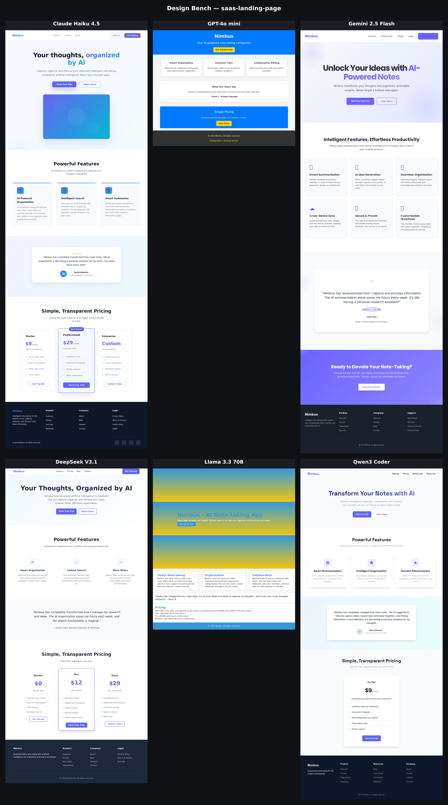
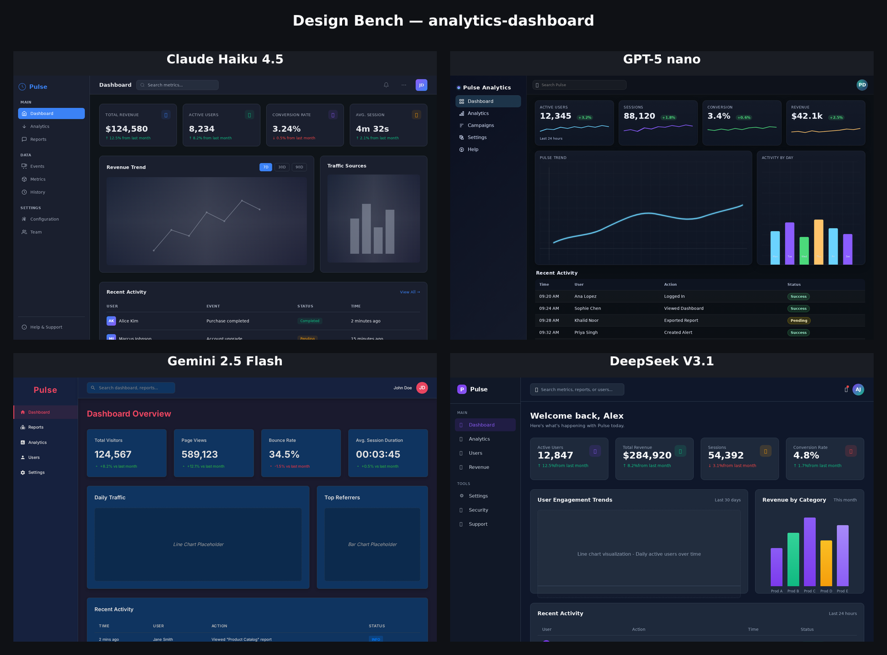
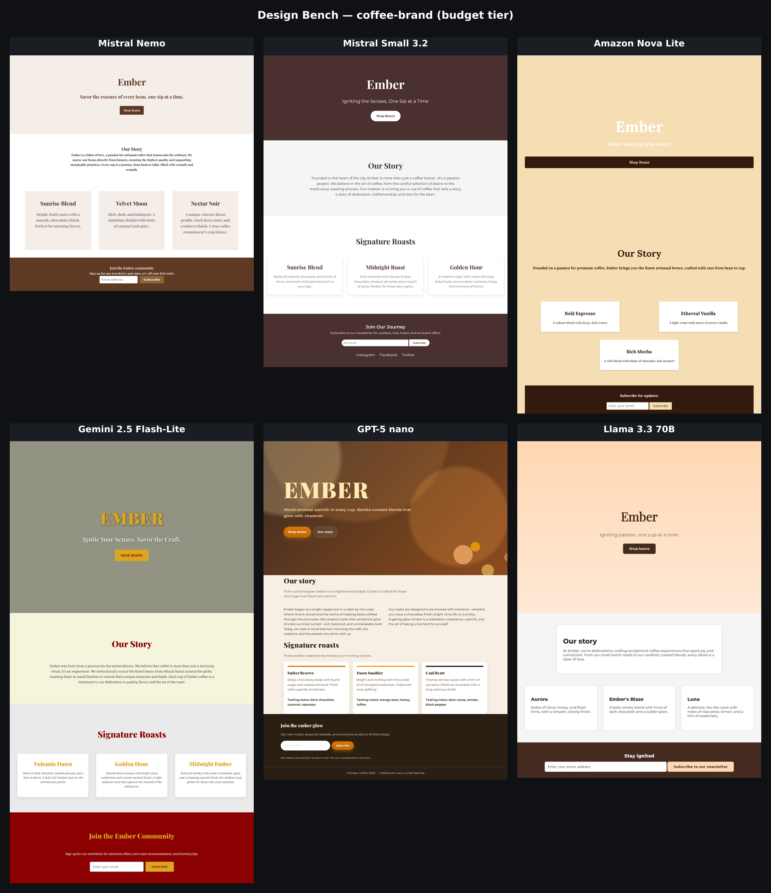

# Examples

Real runs of Design Bench against **cheap models from many providers**, all routed
through OpenRouter. Each folder has the `grid.png` (the deliverable), a `report.md`
(status table), and a `summary.json` (timing + token usage). These are the actual
outputs — open a `grid.png` to see what the benchmark produces.

Reproduce any of them:

```bash
npm run bench                                                  # saas-landing-page (default config)
npm run bench -- --config config/examples/dashboard.config.json
npm run bench -- --config config/examples/coffee-brand.config.json
```

---

## 1. SaaS landing page — broad provider mix

Six models design the same "Nimbus" note-taking landing page. Full-page screenshots,
3-column grid. Config: [`config/benchmark.config.json`](../config/benchmark.config.json).

Models: Claude Haiku 4.5 · GPT-4o mini · Gemini 2.5 Flash · DeepSeek V3.1 · Llama 3.3 70B · Qwen3 Coder



The actual HTML each model produced is in [`saas-landing-page/pages/`](saas-landing-page/pages)
— open them in a browser. See [report](saas-landing-page/report.md).

## 2. Analytics dashboard — UI density, dark mode

Denser brief: a dark-mode "Pulse" analytics dashboard with sidebar, KPI cards, charts
and a table. Viewport-only screenshots, 2-column grid. Config:
[`config/examples/dashboard.config.json`](../config/examples/dashboard.config.json).

Models: Claude Haiku 4.5 · GPT-5 nano · Gemini 2.5 Flash · DeepSeek V3.1



See [report](analytics-dashboard/report.md).

## 3. Coffee brand — budget tier, can small models still be bold?

An expressive brand brief on the **cheapest** models available. Full-page, 3-column grid.
Config: [`config/examples/coffee-brand.config.json`](../config/examples/coffee-brand.config.json).

Models: Mistral Nemo · Mistral Small 3.2 · Amazon Nova Lite · Gemini 2.5 Flash-Lite · GPT-5 nano · Llama 3.3 70B



See [report](coffee-brand/report.md).

---

### Notes from these runs

- Everything ran on **cheap/budget models** — total token usage across all three runs was
  under ~70k tokens, i.e. cents.
- DeepSeek V3.1 is a slow hybrid-reasoning model; it needs a longer `generation.timeoutMs`
  (the configs set 300s). If a model times out or returns no HTML, its cell renders as a
  "no output" placeholder rather than failing the run — the benchmark always produces a grid.
