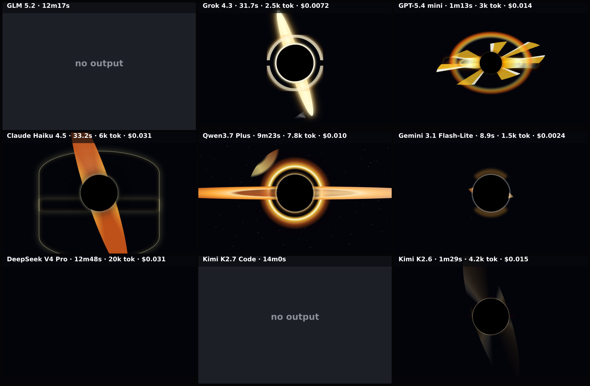

# black-hole-css

CSS-only version of the black-hole-spin benchmark: a spinning 'Gargantua' accretion disk built with pure HTML + CSS — no JavaScript, no canvas, no three.js. A 5-second clip is captured frame-by-frame on the deterministic virtual clock (CSS animation timelines are pinned to it) and composed into one grid video.

**Models:** 9 · **Rendered:** 6/9

## Prompt

Raw copyable version: [prompt.txt](./prompt.txt) · [system-prompt.txt](./system-prompt.txt)

> Create a realistic supermassive black hole — the 'Gargantua' look from the film Interstellar — as a full-screen scene, in PURE CSS (no JavaScript, no canvas). A 5-second clip is captured and looped, so the rotation is as important as the still composition.
> 
> Composition (match so results are comparable — everything centered, frame fixed):
> - A perfectly black EVENT-HORIZON disc dead center, about 30% of the viewport height, with a crisp edge.
> - A bright, thin ACCRETION DISK around it, viewed nearly EDGE-ON so it reads as a near-horizontal bright band cutting across the middle of the black disc and extending well past it on both sides — a wide, flattened ellipse, NOT a head-on ring.
> - Gravitational LENSING: bright arcs bend UP and OVER the top of the black disc AND mirror UNDER the bottom, forming the signature halo arcs above and below the horizon (not merely a flat band). Build them from curved / elliptical shapes wrapping the sphere.
> - A thin, bright PHOTON RING hugging the very edge of the black disc.
> - Disk COLORING: hot white-yellow on the inner edge fading outward to amber then deep orange (#fff3d0 → #ffae3b → #c8551a); make one side slightly brighter than the other (relativistic beaming).
> - Background: near-black space (#03040a) with a sparse scatter of faint, STATIC stars (they do not move).
> 
> Motion (the point of this benchmark — clearly visible and seamlessly looping in 5s):
> - The accretion disk ROTATES about the black hole. Give the disk visible azimuthal structure (brightness clumps, streaks, or banding) and revolve it so a recognizable feature travels around — a conic-gradient or repeating pattern rotated EXACTLY one full turn (or a whole number of turns) over the 5-second clip works well and loops cleanly. A featureless band looks static — make the rotation read clearly.
> - Add subtle shimmer/flicker in the disk and lensing arcs. The frame (camera) stays FIXED; keep the black hole centered and the disk horizontal.
> 
> Return ONLY a single complete HTML document — no JavaScript.

## Grid

▶ **Animated:** [grid.mp4](./grid.mp4) — per-model clips in `models/<slug>/clip.mp4`.

## Results

| Model | ID | Provider | Status | Time | Tokens | Note |
|-------|----|----------|--------|------|--------|------|
| GLM 5.2 | `z-ai/glm-5.2` | openrouter | ❌ error | 736.9s | — | Empty completion (hit token limit before producing output). Raw: {"id":"gen-1783 |
| Grok 4.3 | `x-ai/grok-4.3` | openrouter | ✅ rendered | 31.7s | 3431 |  |
| GPT-5.4 mini | `openai/gpt-5.4-mini` | openrouter | ✅ rendered | 72.8s | 3816 |  |
| Claude Haiku 4.5 | `anthropic/claude-haiku-4.5` | openrouter | ✅ rendered | 33.2s | 6903 |  |
| Qwen3.7 Plus | `qwen/qwen3.7-plus` | openrouter | ✅ rendered | 562.7s | 8622 |  |
| Gemini 3.1 Flash-Lite | `google/gemini-3.1-flash-lite` | openrouter | ✅ rendered | 8.9s | 2234 |  |
| DeepSeek V4 Pro | `deepseek/deepseek-v4-pro` | openrouter | ⬛ blank | 768.0s | 20777 |  |
| Kimi K2.7 Code | `moonshotai/kimi-k2.7-code` | openrouter | ❌ error | 840.0s | — | This operation was aborted |
| Kimi K2.6 | `moonshotai/kimi-k2.6` | openrouter | ✅ rendered | 89.2s | 4971 |  |

Per-model artifacts live in `models/<slug>/` (`raw.txt`, `output.html`, `screenshot.png`, `result.json`).
