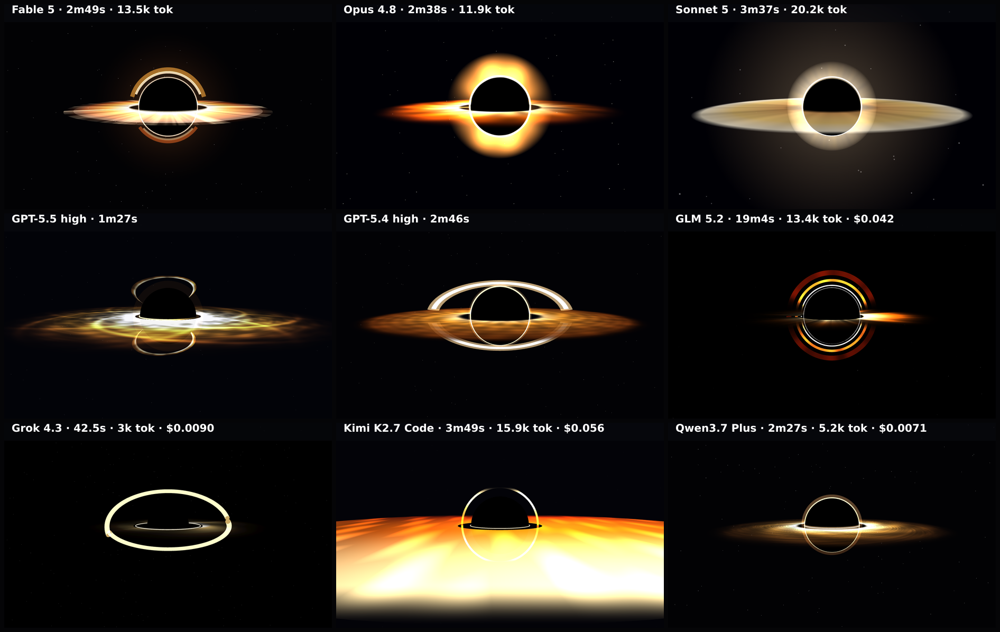

# black-hole-spin-sota

The spinning Gargantua black hole in three.js / WebGL — the same scene as black-hole-spin, run by the SOTA lineup.

**Models:** 9 · **Rendered:** 9/9

## Prompt

Raw copyable version: [prompt.txt](./prompt.txt) · [system-prompt.txt](./system-prompt.txt)

> Render a realistic supermassive black hole — the 'Gargantua' look from the film Interstellar — as a full-screen three.js scene (100vw × 100vh, auto-starting, no user interaction). A 5-SECOND CLIP of the scene is captured, so the motion matters as much as the still composition.
> 
> Composition (match exactly so results are comparable):
> - The black hole (event horizon) is a perfectly black sphere centered in the frame, its diameter about 28% of the viewport height.
> - A bright, thin accretion disk lies in a HORIZONTAL plane around the sphere and is viewed nearly edge-on: the camera sits only about 5–8 degrees above the disk plane, so the disk reads as a near-horizontal bright band cutting across the sphere's middle and extending well past it on both sides.
> - Gravitational lensing: the far side of the disk appears bent UP and OVER the top of the black sphere AND mirrored UNDER the bottom, forming the signature bright halo arcs above and below the horizon (not merely a flat ring). Approximate this with extra bright arcs wrapping over and under the sphere (partial ring/torus geometry works well).
> - A thin, bright photon ring hugs the very edge of the black sphere.
> - Disk coloring: hot white-yellow on the inner edge fading outward to amber then deep orange (#fff3d0 → #ffae3b → #c8551a). Make one side of the disk slightly brighter than the other (relativistic beaming).
> - Background: near-black space with a sparse, dim starfield.
> 
> Motion (the point of this benchmark — must be clearly visible within the 5-second clip):
> - The accretion disk rotates around the black hole at roughly 25–40 degrees per second, so a recognizable feature travels a quarter to half a revolution during the clip. Give the disk visible azimuthal structure (brightness clumps, streaks, or turbulent bands) so the rotation reads clearly — a featureless ring would look static.
> - Add subtle shimmering/flicker in the disk and lensing arcs, and slow drift in the beaming highlight. The camera stays FIXED.
> 
> Keep the black hole centered and the disk horizontal. Return ONLY a single complete HTML document.

## Grid

▶ **Animated:** [grid.mp4](./grid.mp4) — per-model clips in `models/<slug>/clip.mp4`.

## Results

| Model | ID | Provider | Status | Time | Tokens | Note |
|-------|----|----------|--------|------|--------|------|
| Fable 5 | `claude-fable-5` | claude-cli | ✅ rendered | 169.5s | — |  |
| Opus 4.8 | `claude-opus-4-8` | claude-cli | ✅ rendered | 158.0s | — |  |
| Sonnet 5 | `claude-sonnet-5` | claude-cli | ✅ rendered | 216.6s | — |  |
| GPT-5.5 high | `gpt-5.5` | codex-cli | ✅ rendered | 87.5s | — |  |
| GPT-5.4 high | `gpt-5.4` | codex-cli | ✅ rendered | 166.4s | — |  |
| GLM 5.2 | `z-ai/glm-5.2` | openrouter | ✅ rendered | 1144.0s | 14580 |  |
| Grok 4.3 | `x-ai/grok-4.3` | openrouter | ✅ rendered | 42.5s | 4329 |  |
| Kimi K2.7 Code | `moonshotai/kimi-k2.7-code` | openrouter | ✅ rendered | 229.4s | 17096 |  |
| Qwen3.7 Plus | `qwen/qwen3.7-plus` | openrouter | ✅ rendered | 146.7s | 6447 |  |

Per-model artifacts live in `models/<slug>/` (`raw.txt`, `output.html`, `screenshot.png`, `result.json`).
