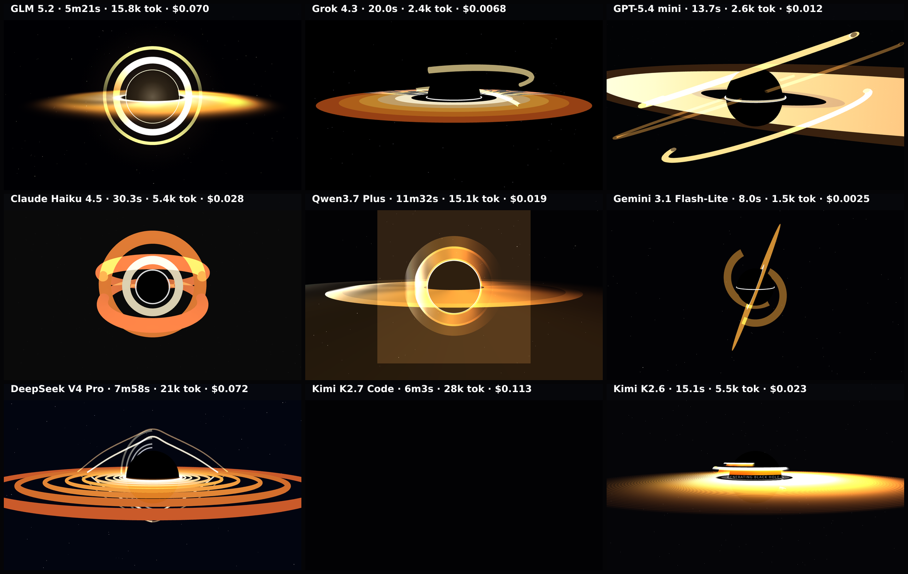

# black-hole

Realistic supermassive black hole ('Gargantua' from Interstellar) in three.js/WebGL. Prescriptive composition so outputs are directly comparable. Deterministic captured frame.

**Models:** 9 · **Rendered:** 8/9

## Prompt

Raw copyable version: [prompt.txt](./prompt.txt) · [system-prompt.txt](./system-prompt.txt)

> Render a realistic supermassive black hole — the 'Gargantua' look from the film Interstellar — as a full-screen three.js scene (100vw × 100vh, auto-starting, no user interaction). Match this exact composition so results are comparable:
> 
> - The black hole (event horizon) is a perfectly black sphere centered in the frame, its diameter about 28% of the viewport height.
> - A bright, thin accretion disk lies in a HORIZONTAL plane around the sphere and is viewed nearly edge-on: the camera sits only about 5–8 degrees above the disk plane, so the disk reads as a near-horizontal bright band cutting across the sphere's middle and extending well past it on both sides.
> - Gravitational lensing: the far side of the disk appears bent UP and OVER the top of the black sphere AND mirrored UNDER the bottom, forming the signature bright halo arcs above and below the horizon (not merely a flat ring). Approximate this with extra bright arcs wrapping over and under the sphere (partial ring/torus geometry works well).
> - A thin, bright photon ring hugs the very edge of the black sphere.
> - Disk coloring: hot white-yellow on the inner edge fading outward to amber then deep orange (#fff3d0 → #ffae3b → #c8551a). Make one side of the disk slightly brighter than the other (relativistic beaming).
> - Background: near-black space with a sparse, dim starfield. The disk rotates slowly.
> 
> Keep the black hole centered and the disk horizontal. Return ONLY a single complete HTML document.

## Grid

## Results

| Model | ID | Provider | Status | Time | Tokens | Note |
|-------|----|----------|--------|------|--------|------|
| GLM 5.2 | `z-ai/glm-5.2` | openrouter | ✅ rendered | 321.4s | 16390 |  |
| Grok 4.3 | `x-ai/grok-4.3` | openrouter | ✅ rendered | 20.0s | 3127 |  |
| GPT-5.4 mini | `openai/gpt-5.4-mini` | openrouter | ✅ rendered | 13.7s | 3206 |  |
| Claude Haiku 4.5 | `anthropic/claude-haiku-4.5` | openrouter | ✅ rendered | 30.3s | 6132 |  |
| Qwen3.7 Plus | `qwen/qwen3.7-plus` | openrouter | ✅ rendered | 692.1s | 15684 |  |
| Gemini 3.1 Flash-Lite | `google/gemini-3.1-flash-lite` | openrouter | ✅ rendered | 8.0s | 2154 |  |
| DeepSeek V4 Pro | `deepseek/deepseek-v4-pro` | openrouter | ✅ rendered | 477.9s | 21585 |  |
| Kimi K2.7 Code | `moonshotai/kimi-k2.7-code` | openrouter | ⬛ blank | 363.4s | 28613 |  |
| Kimi K2.6 | `moonshotai/kimi-k2.6` | openrouter | ✅ rendered | 15.1s | 6117 |  |

Per-model artifacts live in `models/<slug>/` (`raw.txt`, `output.html`, `screenshot.png`, `result.json`).
