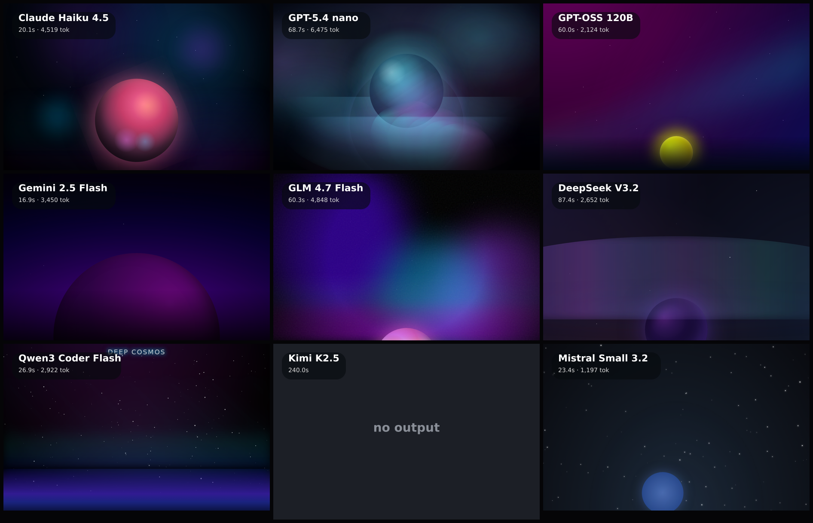

# css-cosmos

Pure-CSS art benchmark: no JS, no images — each model paints an animated cosmic scene with HTML + CSS only.

**Models:** 9 · **Rendered:** 8/9

## Prompt

> Paint an animated cosmic scene with pure CSS: a deep-space aurora or a glowing planet rising over a horizon, with twinkling stars, soft gradient nebulae, and gentle continuous motion (drifting glow, shimmering stars, slow orbit). Dreamy, premium, dark. Show off what CSS alone can do.

## Grid

## Results

| Model | ID | Provider | Status | Time | Tokens | Note |
|-------|----|----------|--------|------|--------|------|
| Claude Haiku 4.5 | `anthropic/claude-haiku-4.5` | openrouter | ✅ html | 20.1s | 4660 |  |
| GPT-5.4 nano | `openai/gpt-5.4-nano` | openrouter | ✅ html | 68.7s | 6609 |  |
| GPT-OSS 120B | `openai/gpt-oss-120b` | openrouter | ✅ html | 60.0s | 2319 |  |
| Gemini 2.5 Flash | `google/gemini-2.5-flash` | openrouter | ✅ html | 16.9s | 3575 |  |
| GLM 4.7 Flash | `z-ai/glm-4.7-flash` | openrouter | ✅ html | 60.3s | 4977 |  |
| DeepSeek V3.2 | `deepseek/deepseek-v3.2` | openrouter | ✅ html | 87.4s | 2782 |  |
| Qwen3 Coder Flash | `qwen/qwen3-coder-flash` | openrouter | ✅ html | 26.9s | 3063 |  |
| Kimi K2.5 | `moonshotai/kimi-k2.5` | openrouter | ❌ error | 240.0s | — | This operation was aborted |
| Mistral Small 3.2 | `mistralai/mistral-small-3.2-24b-instruct` | openrouter | ✅ html | 23.4s | 1334 |  |

Per-model artifacts live in `models/<slug>/` (`raw.txt`, `output.html`, `screenshot.png`, `result.json`).
