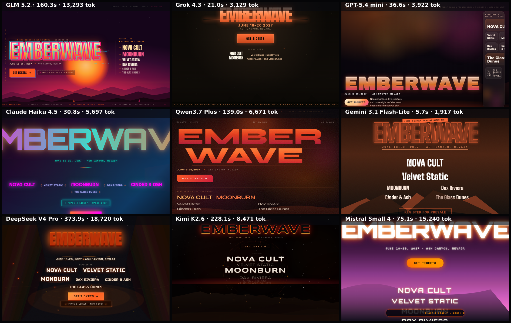

# festival-landing

Landing page for a fictional electronic-music festival. The content is fixed so outputs are comparable; the art direction is deliberately wide open — this brief exists to expose each model's design sensibility, not its ability to follow a template.

**Models:** 9 · **Rendered:** 9/9

## Prompt

> Design the landing page for «EMBERWAVE» — a fictional 3-day electronic music festival held in a desert canyon, June 18–20 2027. This is a DESIGN benchmark: make it look like a real festival site people would screenshot and share. Bold, expressive, atmospheric — pick a strong visual concept (psychedelic, brutalist rave, retro-futurist, cosmic desert — your call) and commit to it fully. Generic corporate layouts will score poorly.
> 
> Required content, all visible within the top ~800px (dense toward the top; the page is captured as a fixed-height crop):
> 1. The festival name «EMBERWAVE» as a dominant typographic statement — treat the wordmark itself as art.
> 2. Date and place: June 18–20, 2027 · Ash Canyon, Nevada.
> 3. A 'Get tickets' call-to-action that fits the art direction.
> 4. A headliner lineup of exactly these six fictional acts, with clear visual hierarchy (headliners bigger): NOVA CULT, Velvet Static, MOONBURN, Dax Riviera, Cinder & Ash, The Glass Dunes.
> 5. A small marquee/ticker or badge announcing 'Phase 2 lineup — March 2027'.
> 
> Use expressive typography (Google Fonts allowed), layered CSS/SVG shapes, gradients, texture, and (optionally) subtle CSS animation. No stock-photo look — build the atmosphere from code. Return ONLY a single complete HTML document.

## Grid

## Results

| Model | ID | Provider | Status | Time | Tokens | Note |
|-------|----|----------|--------|------|--------|------|
| GLM 5.2 | `z-ai/glm-5.2` | openrouter | ✅ rendered | 160.3s | 13731 |  |
| Grok 4.3 | `x-ai/grok-4.3` | openrouter | ✅ rendered | 21.0s | 3681 |  |
| GPT-5.4 mini | `openai/gpt-5.4-mini` | openrouter | ✅ rendered | 36.6s | 4353 |  |
| Claude Haiku 4.5 | `anthropic/claude-haiku-4.5` | openrouter | ✅ rendered | 30.8s | 6204 |  |
| Qwen3.7 Plus | `qwen/qwen3.7-plus` | openrouter | ✅ rendered | 139.0s | 7128 |  |
| Gemini 3.1 Flash-Lite | `google/gemini-3.1-flash-lite` | openrouter | ✅ rendered | 5.7s | 2361 |  |
| DeepSeek V4 Pro | `deepseek/deepseek-v4-pro` | openrouter | ✅ rendered | 373.9s | 19157 |  |
| Kimi K2.6 | `moonshotai/kimi-k2.6` | openrouter | ✅ rendered | 228.1s | 8908 |  |
| Mistral Small 4 | `mistralai/mistral-small-2603` | openrouter | ✅ rendered | 75.1s | 15710 |  |

Per-model artifacts live in `models/<slug>/` (`raw.txt`, `output.html`, `screenshot.png`, `result.json`).
