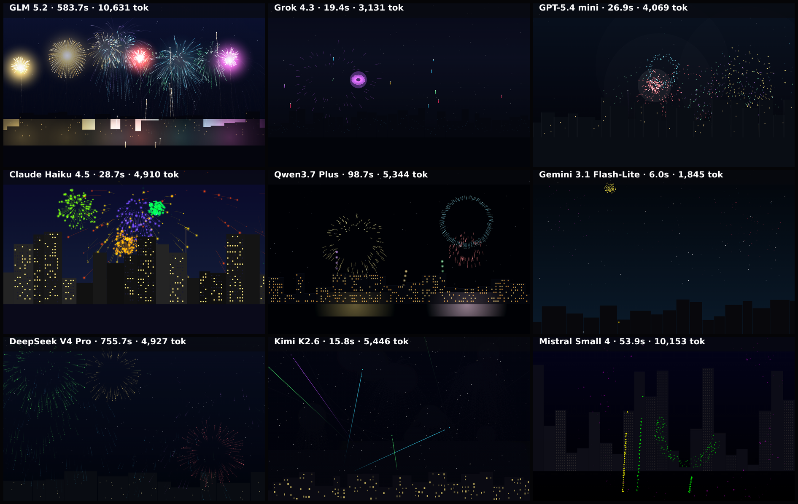

# fireworks

Animated Canvas-2D benchmark: a continuous fireworks finale over a city skyline. A 5-second clip is captured frame-by-frame on the deterministic virtual clock and composed into one grid video.

**Models:** 9 · **Rendered:** 9/9

## Prompt

> Create a continuous FIREWORKS FINALE over a city skyline as a full-screen Canvas 2D animation. A 5-second clip is captured, so the show must be in full swing at ALL times — no idle sky, ever.
> 
> Composition (match so results are comparable):
> - Night sky filling the frame: a deep dark blue-to-black vertical gradient with a few faint stars.
> - A dark city skyline silhouette across the bottom ~18% of the frame — varied building heights, a few tiny lit windows.
> - Fireworks burst in the upper two-thirds of the sky.
> 
> The show (the point of this benchmark — judged on motion):
> - A dense, celebratory rhythm: at any moment 3–6 bursts should be visible in different phases (rocket ascending with a bright trail → explosion → expanding glowing sparks that fall with gravity and fade). Start the show ALREADY IN PROGRESS at t=0 — seed several bursts mid-flight on load.
> - Varied burst types (spherical peony, ring, willow with drooping trails) and varied colors — gold, red, cyan, violet, green — with additive glow.
> - Sparks leave fading trails; brief bloom flash at each detonation; subtle reflected glow on the skyline rooftops when a large burst goes off.
> 
> Use Math.random() freely for variety (it is seeded by the harness — the show will be reproducible). Return ONLY a single complete HTML document.

## Grid

▶ **Animated:** [grid.mp4](./grid.mp4) — per-model clips in `models/<slug>/clip.mp4`.

## Results

| Model | ID | Provider | Status | Time | Tokens | Note |
|-------|----|----------|--------|------|--------|------|
| GLM 5.2 | `z-ai/glm-5.2` | openrouter | ✅ rendered | 583.7s | 11121 |  |
| Grok 4.3 | `x-ai/grok-4.3` | openrouter | ✅ rendered | 19.4s | 3737 |  |
| GPT-5.4 mini | `openai/gpt-5.4-mini` | openrouter | ✅ rendered | 26.9s | 4560 |  |
| Claude Haiku 4.5 | `anthropic/claude-haiku-4.5` | openrouter | ✅ rendered | 28.7s | 5499 |  |
| Qwen3.7 Plus | `qwen/qwen3.7-plus` | openrouter | ✅ rendered | 98.7s | 5858 |  |
| Gemini 3.1 Flash-Lite | `google/gemini-3.1-flash-lite` | openrouter | ✅ rendered | 6.0s | 2349 |  |
| DeepSeek V4 Pro | `deepseek/deepseek-v4-pro` | openrouter | ✅ rendered | 755.7s | 5424 |  |
| Kimi K2.6 | `moonshotai/kimi-k2.6` | openrouter | ✅ rendered | 15.8s | 5938 |  |
| Mistral Small 4 | `mistralai/mistral-small-2603` | openrouter | ✅ rendered | 53.9s | 10682 |  |

Per-model artifacts live in `models/<slug>/` (`raw.txt`, `output.html`, `screenshot.png`, `result.json`).
