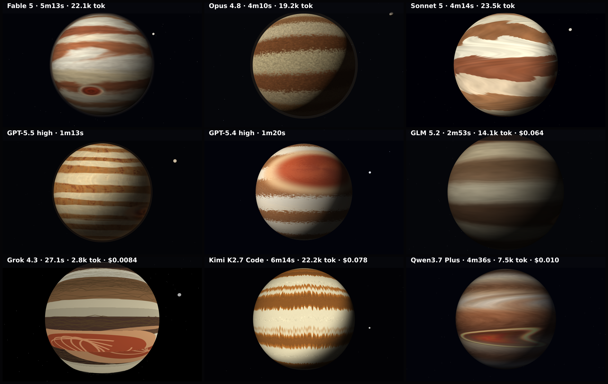

# jupiter

The planet Jupiter — detailed turbulent banded atmosphere and the Great Red Spot — in three.js / WebGL.

**Models:** 9 · **Rendered:** 9/9

## Prompt

Raw copyable version: [prompt.txt](./prompt.txt) · [system-prompt.txt](./system-prompt.txt)

> Render the planet JUPITER as a full-screen three.js scene (100vw × 100vh, auto-starting, no user interaction) — a close-up of the gas giant filling most of the frame. A 5-SECOND CLIP is captured, so the atmospheric motion matters as much as the still.
> 
> Composition (match so results are comparable):
> - Jupiter is a large sphere centered in the frame, its diameter about 78% of the viewport height (it dominates the view). Light it from the upper-left with a soft terminator curving into shadow on the lower-right, and gentle limb darkening at the edge.
> - DETAILED BANDED ATMOSPHERE: alternating horizontal ZONES (light: cream, ivory, pale tan) and BELTS (dark: tan, ochre, red-brown, rust) — at least 8–12 bands of varying width across the disc. The band boundaries are NOT clean lines: they are turbulent, with swirling eddies, wisps and festoons where zones and belts shear against each other. Build the surface from a procedurally detailed, high-frequency texture (a canvas-generated turbulence/noise texture), NOT flat stripes.
> - THE GREAT RED SPOT: a large red-orange oval storm in the southern hemisphere (below the equator, offset left or right of center), roughly 22% of the planet's width, ringed by a paler eyewall with an internal spiral swirl. This is the signature 'eye' — make it unmistakable.
> - Coloring: a warm Jovian palette — cream/ivory zones, tan/ochre/rust belts, the Great Red Spot a deeper brick red-orange.
> - Background: near-black space with a sparse, dim starfield; optionally one tiny bright moon.
> 
> Motion (the point of this benchmark — clearly visible within the 5-second clip):
> - ZONAL FLOW: the bands stream HORIZONTALLY at different speeds, and adjacent bands flow in OPPOSITE directions (as Jupiter's zones and belts do), so texture detail in neighbouring bands visibly shears past itself during the clip. Give the flow visible structure (clumps, wisps, turbulence) so the motion reads clearly — flat scrolling stripes would look wrong.
> - The Great Red Spot slowly churns / rotates (a counter-clockwise swirl) and drifts with its band.
> - Add subtle turbulent shimmer along the band boundaries. Keep Jupiter centered; the flowing, shearing atmosphere must be the dominant, clearly visible motion.
> 
> Return ONLY a single complete HTML document.

## Grid

▶ **Animated:** [grid.mp4](./grid.mp4) — per-model clips in `models/<slug>/clip.mp4`.

## Results

| Model | ID | Provider | Status | Time | Tokens | Note |
|-------|----|----------|--------|------|--------|------|
| Fable 5 | `claude-fable-5` | claude-cli | ✅ rendered | 312.9s | — |  |
| Opus 4.8 | `claude-opus-4-8` | claude-cli | ✅ rendered | 249.8s | — |  |
| Sonnet 5 | `claude-sonnet-5` | claude-cli | ✅ rendered | 253.5s | — |  |
| GPT-5.5 high | `gpt-5.5` | codex-cli | ✅ rendered | 72.9s | — |  |
| GPT-5.4 high | `gpt-5.4` | codex-cli | ✅ rendered | 79.9s | — |  |
| GLM 5.2 | `z-ai/glm-5.2` | openrouter | ✅ rendered | 173.3s | 15268 |  |
| Grok 4.3 | `x-ai/grok-4.3` | openrouter | ✅ rendered | 27.1s | 4150 |  |
| Kimi K2.7 Code | `moonshotai/kimi-k2.7-code` | openrouter | ✅ rendered | 374.0s | 23393 |  |
| Qwen3.7 Plus | `qwen/qwen3.7-plus` | openrouter | ✅ rendered | 276.4s | 8781 |  |

Per-model artifacts live in `models/<slug>/` (`raw.txt`, `output.html`, `screenshot.png`, `result.json`).
