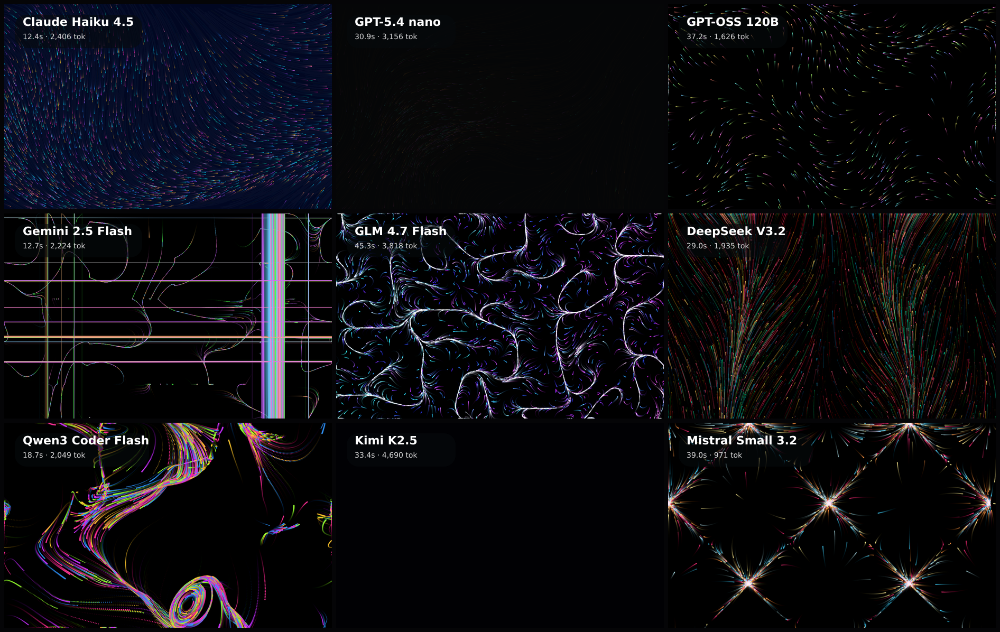

# particle-flow

Canvas particle-system benchmark: each model builds a full-screen animated particle flow field. No libraries required.

**Models:** 9 · **Rendered:** 9/9

## Prompt

> Create a beautiful full-screen animated particle flow field on an HTML canvas: thousands of small particles advected by a smooth noise-driven vector field, leaving soft fading trails, with a vivid but tasteful color palette on a dark background. It should feel alive and organic — like glowing silk or a nebula in motion.

## Grid

## Results

| Model | ID | Provider | Status | Time | Tokens | Note |
|-------|----|----------|--------|------|--------|------|
| Claude Haiku 4.5 | `anthropic/claude-haiku-4.5` | openrouter | ✅ html | 12.4s | 2630 |  |
| GPT-5.4 nano | `openai/gpt-5.4-nano` | openrouter | ✅ html | 30.9s | 3361 |  |
| GPT-OSS 120B | `openai/gpt-oss-120b` | openrouter | ✅ html | 37.2s | 1892 |  |
| Gemini 2.5 Flash | `google/gemini-2.5-flash` | openrouter | ✅ html | 12.7s | 2427 |  |
| GLM 4.7 Flash | `z-ai/glm-4.7-flash` | openrouter | ✅ html | 45.3s | 4019 |  |
| DeepSeek V3.2 | `deepseek/deepseek-v3.2` | openrouter | ✅ html | 29.0s | 2144 |  |
| Qwen3 Coder Flash | `qwen/qwen3-coder-flash` | openrouter | ✅ html | 18.7s | 2264 |  |
| Kimi K2.5 | `moonshotai/kimi-k2.5` | openrouter | ✅ html | 33.4s | 4899 |  |
| Mistral Small 3.2 | `mistralai/mistral-small-3.2-24b-instruct` | openrouter | ✅ html | 39.0s | 1189 |  |

Per-model artifacts live in `models/<slug>/` (`raw.txt`, `output.html`, `screenshot.png`, `result.json`).
