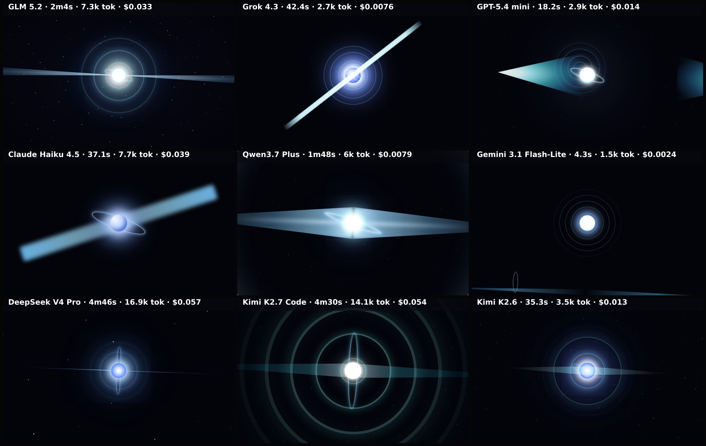

# pulsar-css

CSS-only animated benchmark: a pulsing, rotating pulsar (neutron star) built with pure HTML + CSS — no JavaScript, no canvas. A 5-second clip is captured frame-by-frame on the deterministic virtual clock (CSS animation timelines are pinned to it) and composed into one grid video.

**Models:** 9 · **Rendered:** 9/9

## Prompt

Raw copyable version: [prompt.txt](./prompt.txt) · [system-prompt.txt](./system-prompt.txt)

> Create a PULSING, ROTATING PULSAR (a spinning neutron star firing lighthouse beams) as a full-screen scene — pure HTML + CSS only. A 5-second clip is captured and looped, so the rhythm and rotation are the whole point.
> 
> Composition (match so results are comparable — everything centered, frame fixed):
> - At the exact center, a small intensely bright CORE: a blue-white orb about 9% of the viewport height, hot white at the middle fading through pale blue to a soft outer glow (#f2f6ff → #bcd2ff → #5b7cff), with an additive-looking bloom (layered box-shadow / blur).
> - The core PULSES rhythmically: its brightness and size swell and shrink with a period of exactly 1 second (so ~5 clean pulses across the clip). This pulse is the signature of the benchmark — make it unmistakable.
> - TWO opposing BEAMS (jets) emanate from the core along a single axis tilted about 20° from vertical — long, narrow, tapering cones of cyan-white light (semi-transparent, additive-looking), extending past the top and bottom edges of the frame. The beam axis ROTATES steadily around the center like a lighthouse, completing EXACTLY one full revolution over the 5-second clip (72°/s).
> - Concentric SHOCKWAVE RINGS pulse outward from the core in time with the pulse: on each beat a thin ring is emitted that expands and fades as it grows, so 3–4 rings are visible at different radii at any moment (stagger them with animation-delays). Faint cyan.
> - A thin, bright EQUATORIAL RING/disk hugs the core, seen nearly edge-on as a horizontal bright ellipse, tilted to match the beam axis, steady (not pulsing much).
> - Background: near-black space (#03040a) with a sparse scatter of faint, static stars (small dots via box-shadow or tiny elements) — the stars do NOT move.
> 
> Motion recap (must be visible and loop seamlessly in 5s): core pulses once per second; beams make one full rotation over the clip; shockwave rings expand-and-fade on each pulse; equatorial ring holds steady; stars fixed.
> 
> Return ONLY a single complete HTML document — no JavaScript.

## Grid

▶ **Animated:** [grid.mp4](./grid.mp4) — per-model clips in `models/<slug>/clip.mp4`.

## Results

| Model | ID | Provider | Status | Time | Tokens | Note |
|-------|----|----------|--------|------|--------|------|
| GLM 5.2 | `z-ai/glm-5.2` | openrouter | ✅ rendered | 124.0s | 8040 |  |
| Grok 4.3 | `x-ai/grok-4.3` | openrouter | ✅ rendered | 42.4s | 3608 |  |
| GPT-5.4 mini | `openai/gpt-5.4-mini` | openrouter | ✅ rendered | 18.2s | 3670 |  |
| Claude Haiku 4.5 | `anthropic/claude-haiku-4.5` | openrouter | ✅ rendered | 37.1s | 8553 |  |
| Qwen3.7 Plus | `qwen/qwen3.7-plus` | openrouter | ✅ rendered | 108.5s | 6767 |  |
| Gemini 3.1 Flash-Lite | `google/gemini-3.1-flash-lite` | openrouter | ✅ rendered | 4.3s | 2290 |  |
| DeepSeek V4 Pro | `deepseek/deepseek-v4-pro` | openrouter | ✅ rendered | 286.4s | 17670 |  |
| Kimi K2.7 Code | `moonshotai/kimi-k2.7-code` | openrouter | ✅ rendered | 269.8s | 14929 |  |
| Kimi K2.6 | `moonshotai/kimi-k2.6` | openrouter | ✅ rendered | 35.3s | 4314 |  |

Per-model artifacts live in `models/<slug>/` (`raw.txt`, `output.html`, `screenshot.png`, `result.json`).
