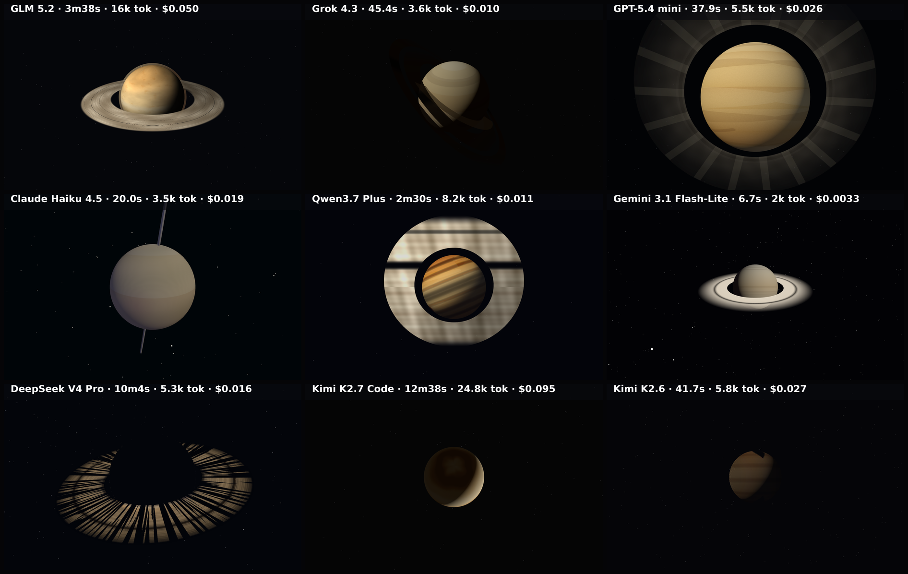

# ringed-giant

A Saturn-like ringed gas giant rotating on its tilted axis, its ring system orbiting in-plane — three.js / WebGL.

**Models:** 9 · **Rendered:** 9/9

## Prompt

Raw copyable version: [prompt.txt](./prompt.txt) · [system-prompt.txt](./system-prompt.txt)

> Render a realistic SATURN-LIKE ringed gas giant as a full-screen three.js scene (100vw × 100vh, auto-starting, no user interaction). A 5-SECOND CLIP is captured, so the motion matters as much as the still composition.
> 
> Composition (match exactly so results are comparable):
> - The planet is a sphere centered in the frame, its diameter about 34% of the viewport height.
> - Give the planet subtle HORIZONTAL atmospheric bands in a warm palette — cream and pale gold through tan to soft amber (#f3e6c4 → #e6c88f → #c99a5b), with faint darker belts and a slightly lighter equatorial zone. No hard edges; the bands blend.
> - A broad RING SYSTEM lies in the planet's equatorial plane, tilted so we view it about 18–24 degrees above edge-on: the rings read as a wide, flattened ellipse crossing the planet, NOT a head-on circle. Rings extend to roughly 2.2× the planet's radius.
> - The rings clearly pass BEHIND the planet's top half (occluded by the sphere) and IN FRONT of its bottom half (crossing over the lit disc) — so the ellipse is broken by the planet, reading as true 3D, not a flat halo.
> - Include one dark GAP in the rings (a Cassini-division-style black band) about two-thirds of the way out.
> - Cast a soft dark SHADOW BAND from the rings onto the planet on the shadowed side, and darken the arc of ring that passes behind the planet into its shadow (fake it — no shadow maps).
> - Light comes from the upper-left: the planet shows a lit crescent and a soft terminator into shadow on the lower-right; the near/left side of the rings is brighter.
> - Ring coloring: pale icy tan, subtly banded lighter/darker, semi-transparent at the inner and outer edges. Background: near-black space with a sparse, dim starfield.
> 
> Motion (the point of this benchmark — clearly visible within the 5-second clip):
> - The planet ROTATES on its (tilted) axis so the atmospheric bands drift horizontally — give the bands visible structure (swirls, spots, or a faint storm oval) so the rotation reads; a featureless sphere would look static. Roughly 20–30 degrees per second.
> - The RINGS orbit in-plane in the same direction: give them faint radial structure / brightness clumps so their revolution is visible, roughly 15–25 degrees per second (inner slightly faster than outer if you can).
> - The camera stays FIXED. Keep the planet centered and the rings horizontal-ish (equatorial).
> 
> Return ONLY a single complete HTML document.

## Grid

▶ **Animated:** [grid.mp4](./grid.mp4) — per-model clips in `models/<slug>/clip.mp4`.

## Results

| Model | ID | Provider | Status | Time | Tokens | Note |
|-------|----|----------|--------|------|--------|------|
| GLM 5.2 | `z-ai/glm-5.2` | openrouter | ✅ rendered | 217.7s | 17300 |  |
| Grok 4.3 | `x-ai/grok-4.3` | openrouter | ✅ rendered | 45.4s | 4695 |  |
| GPT-5.4 mini | `openai/gpt-5.4-mini` | openrouter | ✅ rendered | 37.9s | 6434 |  |
| Claude Haiku 4.5 | `anthropic/claude-haiku-4.5` | openrouter | ✅ rendered | 20.0s | 4565 |  |
| Qwen3.7 Plus | `qwen/qwen3.7-plus` | openrouter | ✅ rendered | 150.1s | 9099 |  |
| Gemini 3.1 Flash-Lite | `google/gemini-3.1-flash-lite` | openrouter | ✅ rendered | 6.7s | 2986 |  |
| DeepSeek V4 Pro | `deepseek/deepseek-v4-pro` | openrouter | ✅ rendered | 603.5s | 6205 |  |
| Kimi K2.7 Code | `moonshotai/kimi-k2.7-code` | openrouter | ✅ rendered | 758.2s | 25752 |  |
| Kimi K2.6 | `moonshotai/kimi-k2.6` | openrouter | ✅ rendered | 41.7s | 6717 |  |

Per-model artifacts live in `models/<slug>/` (`raw.txt`, `output.html`, `screenshot.png`, `result.json`).
