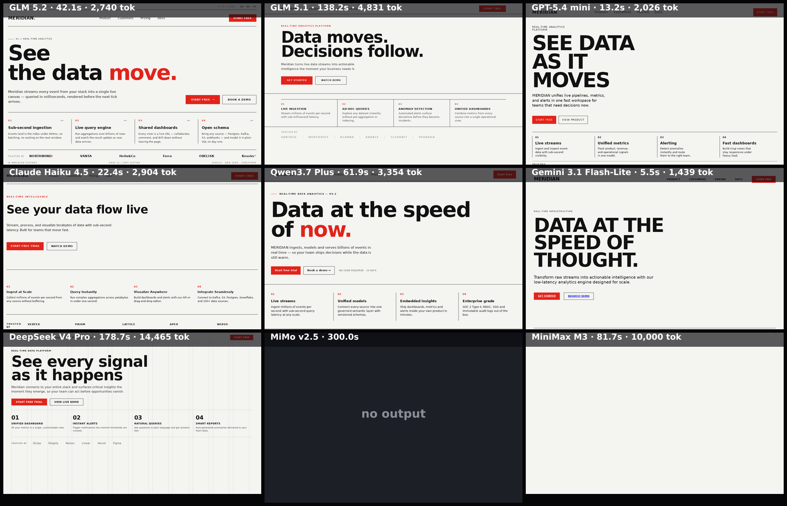

# saas-swiss

Swiss / International Typographic Style SaaS landing page. Detailed, prescriptive brief so model outputs are directly comparable. Dense toward the top; captured as a fixed top-crop.

**Models:** 9 · **Rendered:** 7/9

## Prompt

> Design the top of the landing page for a fictional SaaS product called «MERIDIAN», a real-time data-analytics platform. Render it in a strict Swiss / International Typographic Style and pack the content densely so it all fits within the first screen (roughly the top 800px).
> 
> Style rules (follow exactly):
> - Typeface: Helvetica / Arial / Inter only. Build on a visible 12-column grid with consistent gutters; everything flush-left.
> - Palette: off-white background #F4F4F1, near-black text #111111, and ONE accent color, signal red #E2231A. No gradients, no drop shadows, no rounded corners, no emoji, no photos.
> - Typography: a very large, tight headline; clear hierarchy; small uppercase labels with letter-spacing for section/eyebrow text. Use rules (thin horizontal/vertical lines) to structure the page.
> 
> Content and order (top to bottom, all above the fold):
> 1. A top navigation bar: the wordmark «MERIDIAN» on the left; nav links Product, Customers, Pricing, Docs; and a red 'Start free' button on the right.
> 2. A hero: an eyebrow label, an oversized headline of at most 6 words, a one-sentence subheadline, and two calls to action (a solid red primary, a bordered secondary).
> 3. A full-width thin horizontal rule.
> 4. A row of four numbered feature columns (01–04), each with a short bold title and a one-line description.
> 5. A thin 'Trusted by' row of 5–6 plausible company wordmarks rendered as plain text.
> 
> Return ONLY a single complete HTML document.

## Grid

## Results

| Model | ID | Provider | Status | Time | Tokens | Note |
|-------|----|----------|--------|------|--------|------|
| GLM 5.2 | `z-ai/glm-5.2` | openrouter | ✅ rendered | 42.1s | 3167 |  |
| GLM 5.1 | `z-ai/glm-5.1` | openrouter | ✅ rendered | 138.2s | 5251 |  |
| GPT-5.4 mini | `openai/gpt-5.4-mini` | openrouter | ✅ rendered | 13.2s | 2449 |  |
| Claude Haiku 4.5 | `anthropic/claude-haiku-4.5` | openrouter | ✅ rendered | 22.4s | 3372 |  |
| Qwen3.7 Plus | `qwen/qwen3.7-plus` | openrouter | ✅ rendered | 61.9s | 3804 |  |
| Gemini 3.1 Flash-Lite | `google/gemini-3.1-flash-lite` | openrouter | ✅ rendered | 5.5s | 1883 |  |
| DeepSeek V4 Pro | `deepseek/deepseek-v4-pro` | openrouter | ✅ rendered | 178.7s | 14890 |  |
| MiMo v2.5 | `xiaomi/mimo-v2.5` | openrouter | ❌ error | 300.0s | — | This operation was aborted |
| MiniMax M3 | `minimax/minimax-m3` | openrouter | ⬛ blank | 81.7s | 10584 |  |

Per-model artifacts live in `models/<slug>/` (`raw.txt`, `output.html`, `screenshot.png`, `result.json`).
