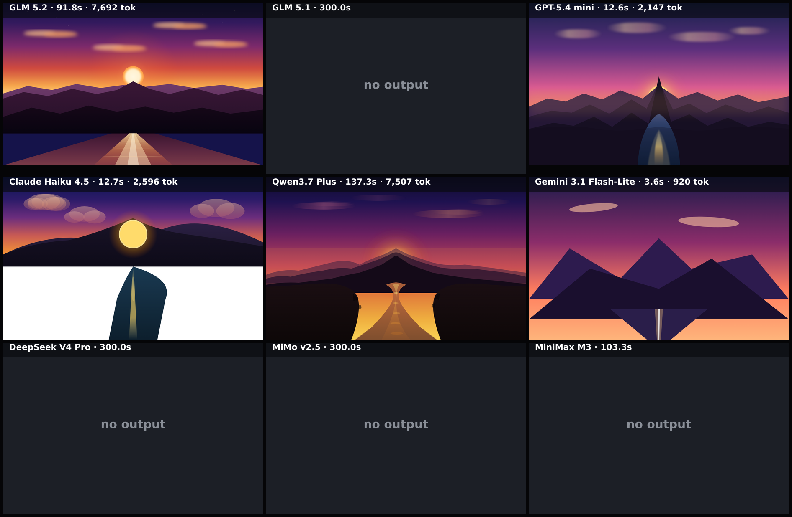

# sunset-svg

A single inline-SVG sunset scene: sun setting behind a mountain range, with clouds and a river. Prescriptive composition so outputs are directly comparable.

**Models:** 9 · **Rendered:** 5/9

## Prompt

> Illustrate a serene sunset landscape as a single inline SVG. Match this composition so results are comparable:
> 
> - Sky fills the top ~55% of the scene: a smooth vertical sunset gradient, deep blue/indigo at the very top, through magenta/pink, to warm orange/gold near the horizon.
> - The sun is a soft glowing circle sitting LOW on the horizon, centered horizontally (about 50% width) and positioned just above and slightly behind the tallest mountain peak.
> - A layered mountain range as silhouettes across the middle of the scene: 2–3 overlapping ridgelines, each darker/closer toward the front, with the tallest peak near the center directly in front of the sun.
> - A few soft, elongated clouds in the upper sky, tinted warm by the sunset.
> - A river in the foreground (bottom ~20%) widening as it flows toward the viewer from the base of the mountains, reflecting the sun as a vertical shimmer of warm light down its center.
> 
> Smooth gradients, clean layered vector shapes, a cohesive warm palette, clear depth. Optionally add subtle ambient motion (slowly drifting clouds or a shimmering reflection). It is JUST the scene — no text, no UI, no border. Return ONLY a single complete HTML document.

## Grid

## Results

| Model | ID | Provider | Status | Time | Tokens | Note |
|-------|----|----------|--------|------|--------|------|
| GLM 5.2 | `z-ai/glm-5.2` | openrouter | ✅ rendered | 91.8s | 8075 |  |
| GLM 5.1 | `z-ai/glm-5.1` | openrouter | ❌ error | 300.0s | — | This operation was aborted |
| GPT-5.4 mini | `openai/gpt-5.4-mini` | openrouter | ✅ rendered | 12.6s | 2526 |  |
| Claude Haiku 4.5 | `anthropic/claude-haiku-4.5` | openrouter | ✅ rendered | 12.7s | 3017 |  |
| Qwen3.7 Plus | `qwen/qwen3.7-plus` | openrouter | ✅ rendered | 137.3s | 7907 |  |
| Gemini 3.1 Flash-Lite | `google/gemini-3.1-flash-lite` | openrouter | ✅ rendered | 3.6s | 1301 |  |
| DeepSeek V4 Pro | `deepseek/deepseek-v4-pro` | openrouter | ❌ error | 300.0s | — | This operation was aborted |
| MiMo v2.5 | `xiaomi/mimo-v2.5` | openrouter | ❌ error | 300.0s | — | This operation was aborted |
| MiniMax M3 | `minimax/minimax-m3` | openrouter | ❌ error | 103.3s | — | Empty completion. Raw: {"id":"gen-1782846819-2fAt1rdRmz21iBOkvjll","object":"cha |

Per-model artifacts live in `models/<slug>/` (`raw.txt`, `output.html`, `screenshot.png`, `result.json`).
