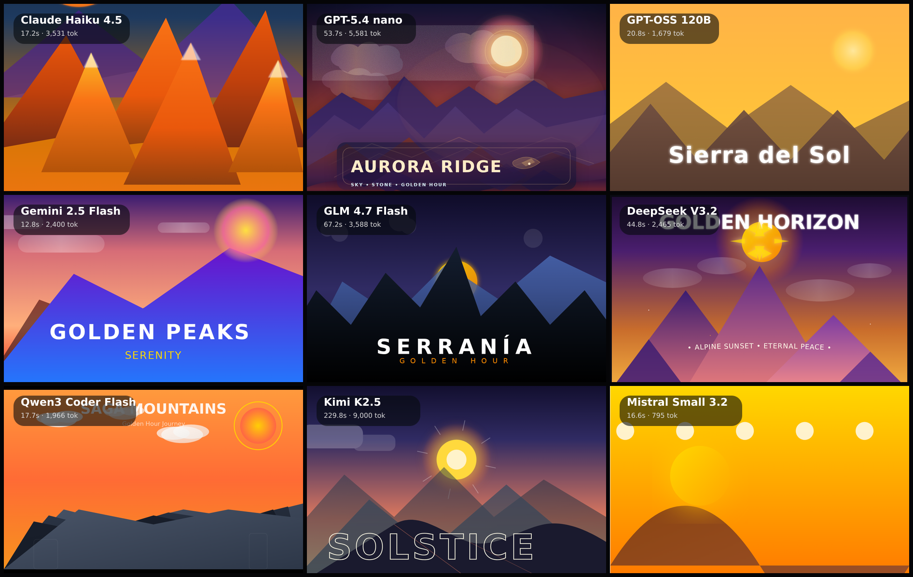

# svg-poster

Vector-art benchmark: each model hand-codes a single animated SVG poster — testing pure vector composition, color and typography.

**Models:** 9 · **Rendered:** 9/9

## Prompt

> Design a striking travel/art poster as a single inline SVG: a stylized mountain-and-sun landscape at golden hour (or an equally bold geometric scene), with layered gradients, clean geometric shapes, a gentle ambient animation (drifting clouds, shimmering sun, or parallax layers), and elegant display typography naming the place. Confident composition, rich cohesive palette.

## Grid

## Results

| Model | ID | Provider | Status | Time | Tokens | Note |
|-------|----|----------|--------|------|--------|------|
| Claude Haiku 4.5 | `anthropic/claude-haiku-4.5` | openrouter | ✅ html | 17.2s | 3710 |  |
| GPT-5.4 nano | `openai/gpt-5.4-nano` | openrouter | ✅ html | 53.7s | 5741 |  |
| GPT-OSS 120B | `openai/gpt-oss-120b` | openrouter | ✅ html | 20.8s | 1900 |  |
| Gemini 2.5 Flash | `google/gemini-2.5-flash` | openrouter | ✅ html | 12.8s | 2555 |  |
| GLM 4.7 Flash | `z-ai/glm-4.7-flash` | openrouter | ✅ html | 67.2s | 3744 |  |
| DeepSeek V3.2 | `deepseek/deepseek-v3.2` | openrouter | ✅ html | 44.8s | 2627 |  |
| Qwen3 Coder Flash | `qwen/qwen3-coder-flash` | openrouter | ✅ html | 17.7s | 2133 |  |
| Kimi K2.5 | `moonshotai/kimi-k2.5` | openrouter | ✅ html | 229.8s | 9163 |  |
| Mistral Small 3.2 | `mistralai/mistral-small-3.2-24b-instruct` | openrouter | ✅ html | 16.6s | 962 |  |

Per-model artifacts live in `models/<slug>/` (`raw.txt`, `output.html`, `screenshot.png`, `result.json`).
