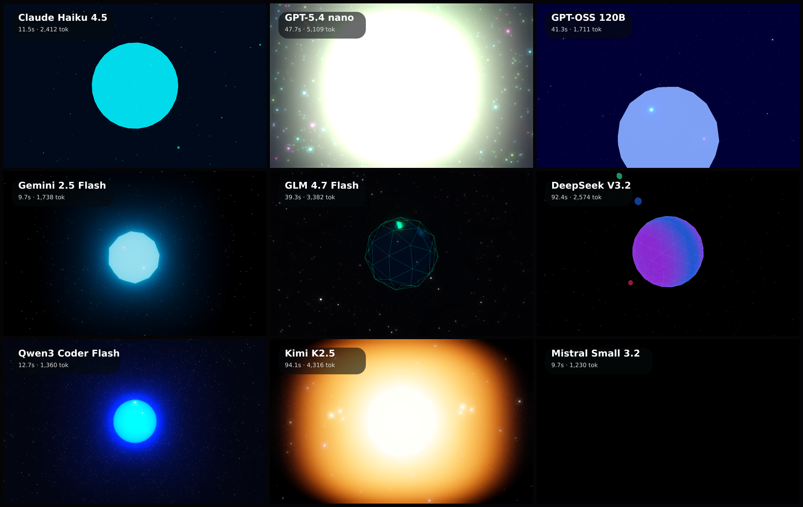

# threejs-orb

3D rendering benchmark: each model builds a full-screen three.js scene of a glowing, rotating orb. Loaded from CDN, captured after the animation settles.

**Models:** 9 · **Rendered:** 9/9

## Prompt

> Create a mesmerizing full-screen three.js scene: a glowing, slowly rotating crystalline orb or icosahedron floating in space, with emissive material, colored point lights, subtle bloom-like glow, and a field of small drifting particles or stars around it. Cinematic, premium, dark and atmospheric. It must look beautiful immediately on load.

## Grid

## Results

| Model | ID | Provider | Status | Time | Tokens | Note |
|-------|----|----------|--------|------|--------|------|
| Claude Haiku 4.5 | `anthropic/claude-haiku-4.5` | openrouter | ✅ html | 11.5s | 2685 |  |
| GPT-5.4 nano | `openai/gpt-5.4-nano` | openrouter | ✅ html | 47.7s | 5342 |  |
| GPT-OSS 120B | `openai/gpt-oss-120b` | openrouter | ✅ html | 41.3s | 2005 |  |
| Gemini 2.5 Flash | `google/gemini-2.5-flash` | openrouter | ✅ html | 9.7s | 1973 |  |
| GLM 4.7 Flash | `z-ai/glm-4.7-flash` | openrouter | ✅ html | 39.3s | 3614 |  |
| DeepSeek V3.2 | `deepseek/deepseek-v3.2` | openrouter | ✅ html | 92.4s | 2807 |  |
| Qwen3 Coder Flash | `qwen/qwen3-coder-flash` | openrouter | ✅ html | 12.7s | 1605 |  |
| Kimi K2.5 | `moonshotai/kimi-k2.5` | openrouter | ✅ html | 94.1s | 4551 |  |
| Mistral Small 3.2 | `mistralai/mistral-small-3.2-24b-instruct` | openrouter | ✅ html | 9.7s | 1471 |  |

Per-model artifacts live in `models/<slug>/` (`raw.txt`, `output.html`, `screenshot.png`, `result.json`).
